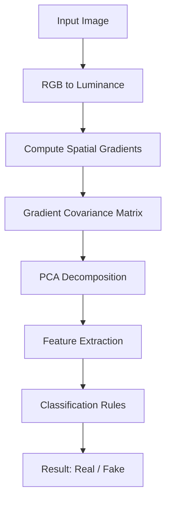
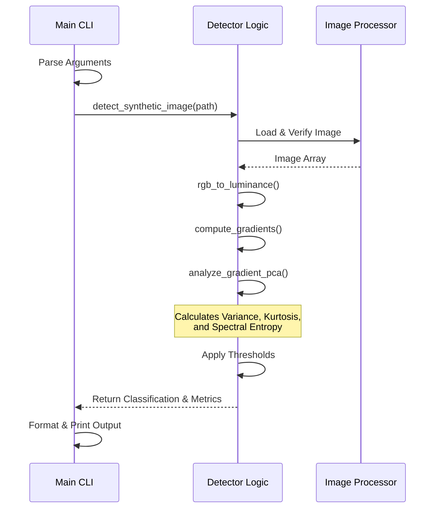

# Architecture & Logic

This document explains the technical architecture and the theoretical logic behind the Synthetic Image Detector.

## 🧠 Core Logic: Gradient Field Analysis

The detector works on the principle that Generative AI models (like Stable Diffusion, Midjourney) and physical cameras construct images differently.

### 1. The Physical Model (Real Images)
*   **Origin**: Light hitting a physical sensor.
*   **Characteristics**: Lighting creates smooth, coherent gradients. Noise is typically Poissonian (shot noise) or Gaussian (read noise), which is uniform and unstructured.
*   **Gradient Field**: Isotropic (similar properties in all directions) or structured by the physical geometry of the scene.

### 2. The Diffusion Model (AI Images)
*   **Origin**: Iterative denoising from pure Gaussian noise.
*   **Characteristics**: The reverse diffusion process often leaves high-frequency residual artifacts.
*   **Gradient Field**: Anisotropic instablities and "ridges" in the gradient covariance matrix that don't match physical lighting falloff.

## ⚙️ Implementation Pipeline

The logic is implemented in `detector.py` following this pipeline:

### Sequence Diagram

### Step 1: Preprocessing (`detector.rgb_to_luminance`)
We convert the HxWx3 color image to a single HxW luminance channel using ITU-R BT.709 coefficients. Color information is discarded to focus purely on structural texture.

### Step 2: Gradient Computation (`detector.compute_gradients`)
We calculate the first-order derivatives (pixel differences) in X and Y directions.
*   $G_x(i,j) = I(i, j+1) - I(i, j-1)$
*   $G_y(i,j) = I(i+1, j) - I(i-1, j)$

### Step 3: PCA Analysis (`detector.analyze_gradient_pca`)
We treat every pixel's gradient $(g_x, g_y)$ as a data point in 2D space.
1.  Form the covariance matrix of these gradients.
2.  Compute Eigenvalues ($\lambda_1, \lambda_2$).
3.  Project gradients onto the principal component.

### Step 4: Decision Metrics
We extract specific features that separate Real from Fake:

| Metric | Real Behavior | AI/Diffusion Behavior |
| :--- | :--- | :--- |
| **Coefficient of Variation** | Lower | **Higher** (Unstable local gradients) |
| **Kurtosis** | Normal | **High** (Heavy tails/outliers in gradient distribution) |
| **High-Freq Ratio** | Balanced | **Concentrated** (Pixel-level noise artifacts) |
| **Eigenvalue Ratio** | Anisotropic | **Mixed** (Often overly isotropic or oddly skewed) |

> **Note:** The scoring system is **Weighted**. Structural metrics (Eigenvalue Ratio, CV) have higher priority than Noise metrics (Kurtosis, HF Ratio). This prevents noisy real photos (e.g., high ISO) from being misclassified as fake.

> **Note:** The scoring system is **Weighted**. Structural metrics (Eigenvalue Ratio, CV) have higher priority than Noise metrics (Kurtosis, HF Ratio). This prevents noisy real photos (e.g., high ISO) from being misclassified as fake.

## 📊 Visualization Logic

When you run with `--visualize`, the system generates three diagnostic plots to help explain the decision.

### 1. Original Image
This is simply the reference input image.

### 2. Luminance Gradient Field (Relief)
**What it is:** A visualization of the raw gradient data, calculated as $G_x + G_y$.
**Logic:**
*   This represents the "texture structure" that the algorithm sees.
*   **Real Images:** You should see clear physical lighting directions (e.g., shadows on one side of objects) and continuous edges.
*   **Fake Images:** May look "mushy" or have inconsistent lighting directions that don't make physical sense.

### 3. PCA Projection (Structural Anomalies)
**What it is:** The most critical diagnostic tool. It projects the gradient of every pixel onto the first principal component (eigenvector).
**Logic:**
*   This map highlights the "noise floor" and structural consistency of the image.
*   **Real Images (Consistent):** The projection map typically looks like a *ghost* of the original image. You can clearly see object boundaries. The background noise is uniform (camera sensor noise).
*   **Fake Images (Unstable):** The projection map often reveals:
    *   **High-frequency Snow:** Random, jagged noise that doesn't follow the image content.
    *   **Dead Zones:** Areas of unnaturally flat gradients.
    *   **Grid Artifacts:** Regular patterns left by the diffusion UNet's latent space processing.

The **Kurtosis** metric essentially measures how "jagged" or "outlier-heavy" this PCA Projection map is. A high kurtosis in this map is a strong indicator of diffusion synthesis.

## 📂 File Structure

*   `main.py`: **Entry Point**. Handles CLI arguments, file I/O, and user display.
*   `detector.py`: **Core Logic**. Contains the math, image processing, and classification rules. Pure functional design.
*   `requirements.txt`: Python package dependencies.
